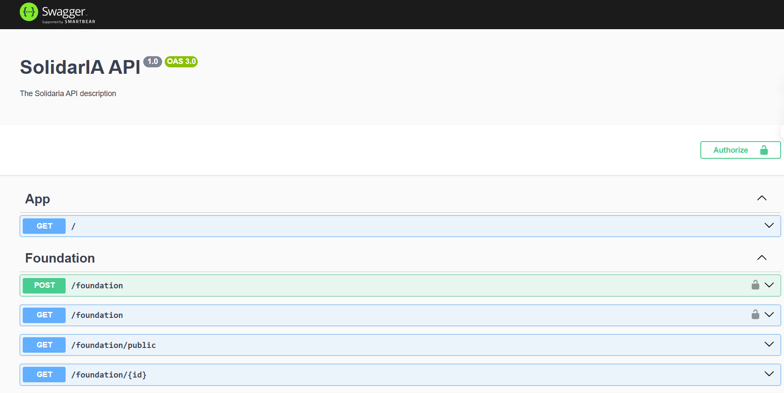
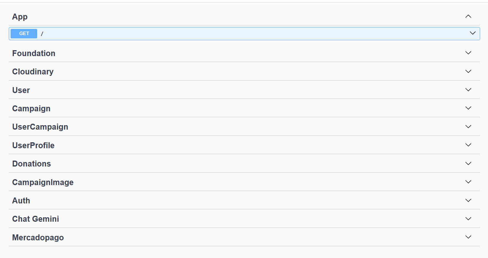
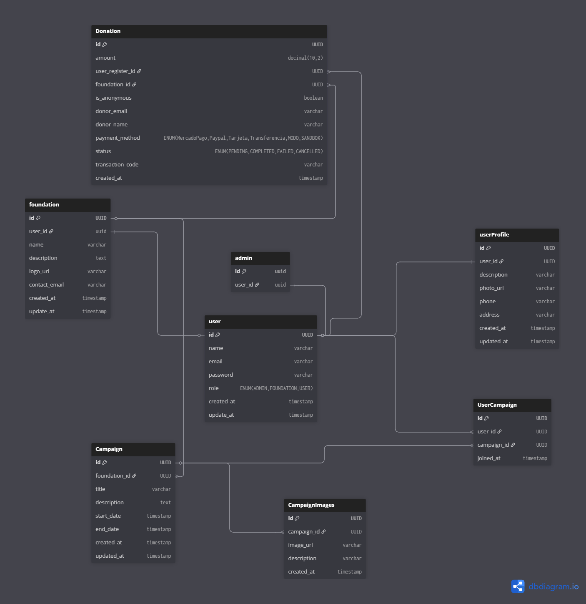

👥 Equipo de Desarrollo

* Franco Torrico — linkedin.com/in/francotorrico

* Dana Torres — linkedin.com/in/dana-torres-2247801b7

* Nelson Salto — linkedin.com/in/nelson-david-salto-21568b178

* Esteban Karaputny — linkedin.com/in/esteban-karaputny

* Alan Quispe — linkedin.com/in/alan-quispe-1a0a53314

🎯 Objetivo del Proyecto

El proyecto SolidarIA busca crear una plataforma digital que conecte fundaciones, voluntarios y donantes dentro de un mismo entorno.
Nuestro objetivo es facilitar la gestión de campañas solidarias, promover la participación comunitaria y mejorar la transparencia en los procesos de donación.

Además, incorporamos un chatbot con inteligencia artificial (Gemini) que brinda asistencia a los usuarios dentro de la plataforma, ofreciendo información sobre campañas, fundaciones y procesos de registro, mejorando así la experiencia de interacción y accesibilidad.

De esta forma, buscamos potenciar el impacto social mediante la tecnología, brindando un espacio confiable, moderno y accesible para quienes desean colaborar o recibir ayuda.

🖥️ Back-end — Arquitectura General

Framework: NestJS

Lenguaje: TypeScript

ORM: Prisma

Base de datos: PostgreSQL

Administración: pgAdmin

Deploy: Aws EC2

Contenedores: Docker

🔹 Función Principal

El back-end tiene como objetivo principal gestionar la lógica de negocio, la persistencia de datos y la comunicación con servicios externos, incluyendo:

Gestión de usuarios: Registro, inicio de sesión, roles y permisos.

Gestión de entidades del proyecto: CRUD de recursos principales (campañas, Fundaciones, voluntarios, donaciones, ).

Autenticación y seguridad: JWT.

Integración con servicios externos:

 - AWS: Almacenamiento de archivos y recursos (EC2).

 - Cloudinary: Manejo de imágenes.

 - Mercado Pago SDK: Procesamiento de pagos, creación de preferencias y notificaciones de pago.

Exposición de API: REST para conectar con el front-end.

## 🗂️ **Repositorios**

| Módulo    | Repositorio             | Descripción                                           |
| --------- | ----------------------- | ----------------------------------------------------- |
| Front-end | [📁 `frontend-next`](https://github.com/Danadty/solidarIA-Front) | Proyecto en **Next.js** con UI y componentes visuales |
| Back-end  | [📁 `backend-nest`](https://github.com/Danadty/solidarIA)  | API construida en **NestJS** con Prisma y PostgreSQL  |

---

🔹 Buenas prácticas implementadas

Modularización por dominios para mantener el código organizado y escalable.

Validación de datos con class-validator y DTOs.

Manejo de errores centralizado.

Uso de variables de entorno para credenciales y configuraciones sensibles.

Integración con Swagger para documentación de la API.

🔹 visualización de la información

** swagger completo **

** swagger por ruta **

** instancia ec2 corriendo pm2  **

🔹 Conociendo nuestros diagramas

                ┌──────────────────────────┐
                │        Front-end         │
                │   Next.js + TypeScript   │
                │       (Vercel)           │
                └────────────┬─────────────┘
                             │
                             ▼
                ┌──────────────────────────┐
                │        Back-end          │
                │ NestJS + Prisma + JWT    │
                │   (AWS EC2 + Docker)     │
                └────────────┬─────────────┘
                             │
       ┌──────────────┬──────────────┬──────────────┬──────────────┐
       │ PostgreSQL   │ Cloudinary   │ Mercado Pago │ Gemini AI    │
       │ (pgAdmin)    │ (Imágenes)   │ (Pagos)      │ (Chatbot IA) │
       └──────────────┴──────────────┴──────────────┴──────────────┘

** nuestro diagrama de base de datos **

** nuestro diagrama de nuestra arquitectura **

⚙️ Instalación y configuración del proyecto para Backend 

🔧 Requisitos previos

Antes de comenzar, asegurate de tener instalado:

Node.js
 (v20 o superior)

Docker

PostgreSQL
 
Git

🖥️ 1. Clonar los repositorios backend

🧩 2. Configurar variables de entorno

Crea un archivo .env en la raíz de cada repositorio con tus credenciales.

DATABASE_URL=""
JWT_SECRET="clave-secreta"
CLOUDINARY_CLOUD_NAME="tu-cloud-name"
CLOUDINARY_API_KEY="tu-api-key"
CLOUDINARY_API_SECRET="tu-api-secret"
MP_ACCESS_TOKEN="tu-access-token-mercadopago"
GEMINI_API_KEY="tu-api-key-gemini"
PORT=3000

🧱 3. Instalar dependencias 

     pnpm install

🐳 4. Ejecutar con Docker Compose

     docker compose up

🗄️  5. Configurar la base de datos con Prisma

     pnpm prisma migrate dev
     pnpm prisma generate

🚀 6. Ejecutar el proyecto localmente

    pnpm run start:dev
     
💬 Cierre

A lo largo del desarrollo aplicamos tecnologías modernas como NestJS, Next.js, AWS y Mercado Pago SDK, priorizando la colaboración, escalabilidad y buenas prácticas.
Este proyecto refleja no solo nuestras habilidades técnicas, sino también nuestro compromiso con causas sociales y el trabajo en equipo.
